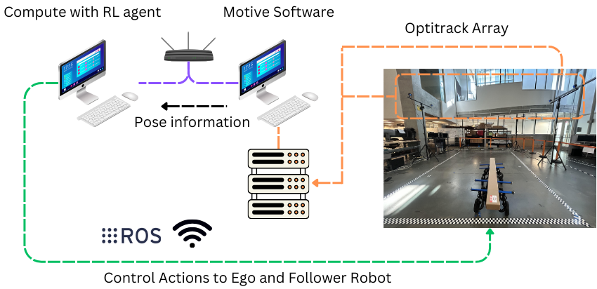

## Deep Reinforcement Learning for Coordinated Payload Transport in Biped-Wheeled Robots
Deep Reinforcement Learning (DRL) for Coordinated Payload Transport in Biped-Wheeled Robots  A unified kinematic model integrated PyTorch-based framework that trains a DRL agent to coordinate two biped-wheeled robots for cooperative payload transport.

A demonstration repository showing:

1. **Deep Reinforcement Learning**-based payload transport in simulation
2. **Sim-to-Real** deployment on the Diablo biped-wheeled robots

---

## 🚀 Prerequisites

1. **Isaac Lab & Isaac Sim** 
   - NVIDIA Omniverse Isaac Sim (4.5.0) & Isaac Lab (2.1) installed 
   - [Installation guide](https://isaac-sim.github.io/IsaacLab/main/source/setup/installation/index.html)

2. **Workstation Requirements** 
   - GPU: NVIDIA RTX 30xx series or higher (≥16 GB VRAM) 
   - CPU: Intel Core i7 (9th Generation) AMD Ryzen 7
   - RAM: ≥32 GB 
   - Ubuntu 22.04 LTS

3. **Diablo Robot Hardware** 
   - DirecDrive Tech's Diablo biped-wheeled robots (x2)
   - ROS Noetic (Linux) 
   - Diablo URDF + control stack

4. **OptiTrack Motion Capture** 
   - Motive v3.0+ installed & calibrated 
   - OptiTrack (NatNet) streaming engine with mocap_optitrack ROS package
   - [Guide](https://tuw-cpsg.github.io/tutorials/optitrack-and-ros/)

---
## Important Files and Directories
1. **dual_diablo** - Contains the environment file and RL agent files
2. **dual_diablo.py** - Contains the actuator and additional configurations of the biped-wheeled robot in simulation
3. **USD_DualDiablo** - Contains the USD files of the payload and biped-wheeled robot 

## 📁 Directory Structure

Copy the folder dual_diablo (contains the environment and RL agent files) & dual_diablo.py (robot config file) in the IsaacLab directory as shown:
```
── IsaacLab
    └── source
        ├── isaaclab_assets
        │   └── isaaclab_assets
        │       └── robots
        │           └── dual_diablo.py
        └── isaaclab_tasks
            └── isaaclab_tasks
                └── direct
                    └── dual_diablo
```
## 🕹️ Running in Simulation
### Ensure the paths of waypoints/payload path is modified in the dual_diablo_env.py file and the USD path in dual_diablo.py file
### Running the training
```
./isaaclab.sh -p scripts/reinforcement_learning/rsl_rl/train.py --task DualDiablo_Task_Simple --num_envs 4096 --headless
```

### Running the Evaluation (You can modify the paths and payload for testing)
```
./isaaclab.sh -p scripts/reinforcement_learning/rsl_rl/play.py --task DualDiablo_Task_Simple --num_envs 4 --checkpoint /home/Your_Directory/IsaacLab/logs/rsl_rl/dualdiablo_rsl_rl/2025-05-13_20-18-28/model_500.pt
```
### 🎥 Video Demonstrations - Simulation
#### Training
https://github.com/user-attachments/assets/952ce4bc-7a30-4493-a7c0-d93f37e591a1

#### Evaluation
https://github.com/user-attachments/assets/4c6d47d7-918d-4ac7-a51b-fb5547412ac9

# Real-World Deployment

The deployment is organized into three phases:

1. **OptiTrack Setup**
2. **Robot & Payload Setup**
3. **DRL Interface Initialization**

---

## 1. OptiTrack Setup

### Hardware

- **Cameras:** 12 OptiTrack units arranged around the workspace  
- **Reflective markers:** ≥ 3 per rigid body (we use 4 for extra accuracy)

  
*Figure 1: Real-World Workflow*

  
*Figure 2: Markers on robot & payload (geometric center tracking)*

### Software

1. **Install ROS‑OptiTrack packages**  
   Follow the [OptiTrack + ROS tutorial](https://tuw-cpsg.github.io/tutorials/optitrack-and-ros/).

2. **Launch motion capture**  
   ```bash
   roslaunch mocap_optitrack mocap.launch
   ```

3. **Verify topics**  
   ```bash
   rostopic list
   ```

---

## 2. Robot & Payload Setup

> **Note:** Repeat for each robot, swapping in its specific IP, hostname, and topic names.

### Prerequisites

- ROS Noetic (ROS 1)  
- Diablo ROS1 SDK

### Install Diablo SDK

```bash
mkdir -p ~/catkin_ws/src
cd ~/catkin_ws/src
git clone https://github.com/DDTRobot/diablo-sdk-v1.git
cd ~/catkin_ws
catkin_make
```

### Configure Environment

Add to your `~/.bashrc` (replace `<robot_ip>` and `<network_ip>`):

```bash
source /opt/ros/noetic/setup.bash
source ~/catkin_ws/devel/setup.bash
export ROS_HOSTNAME="<robot_ip>"
export ROS_MASTER_URI="http://<network_ip>:11311"
```

### Update & Run Robot Code

1. **C++ Controller**  
   - File: `diablo-sdk-v1/example/movement_ctrl/main.cpp`  
   - Swap in your `cmd_vel_ego` / `cmd_vel_follower` topics.  
   (See `Diablo_Robot_Code/main.cpp` for reference.)

2. **Python Teleop**  
   - Script: `script/teleop.py`  
   - Publishers: `DJ_teleop` (ego) and `DJ_teleop2` (follower)

3. **Launch**

```bash
rosrun diablo_sdk movement_ctrl_example
python3 teleop.py
```

- Press `k` for mid-height, `j` for full-height.

---

## 3. DRL Interface Initialization

Run the ONNX-based ROS interface in Real_World_Code folder on the robot or the workstation (requires ONNX Runtime):

```bash
python3 Diablo_ROS_interface_ONNX_RSLRL.py
```
This script subscribes to OptiTrack topics, feeds observations into your DRL model, and publishes the resulting body twists back to each robot.
  
*Real World Video of Biped-Wheeled Robot: Diablo*


If you find this research useful, please consider citing the paper
```
@unknown{unknown,
author = {Mehta, Dhruv and Joglekar, Ajinkya and Krovi, Venkat},
year = {2024},
month = {09},
pages = {},
title = {Deep Reinforcement Learning for Coordinated Payload Transport in Biped-Wheeled Robots},
doi = {10.13140/RG.2.2.10251.71207/1}
}
```

